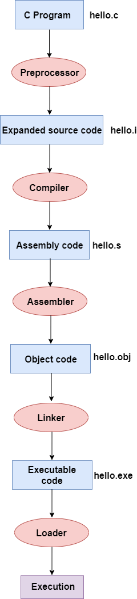

# The Compilation of C
> 
>
> C is compiled in 4 steps, the **Preproccessor**, **Compiler**, **Assembler**, **Linker**, then the .exe file is executed by the loader. The code changes from being **source code (main.c)**, to **expanded source code (main.i)**, to **assenbly code (main.s)**, to **object code (main.obj)**, to , finaly, **executeable code (main.exe)**.
>
> ## Preprocessor
>> Even when no pre-processing directives are given, the preprocessor will always do 3 things:
>>      - Replace all comments with a single space
>>      -  
>>
>> - a pre-proccessing directive is a line that starts with a ```#``` like ```#include <stdio.h>```.
>
> ## Compiler
>>
>
> ## Assembler
>>
>
> ## Linker
>>
>
> #